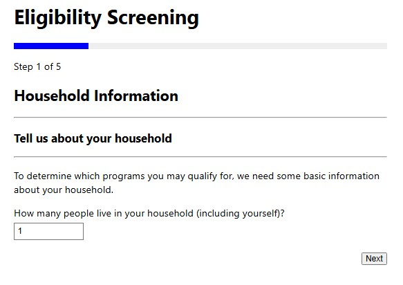
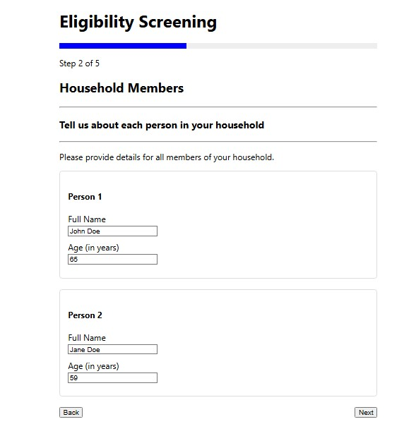
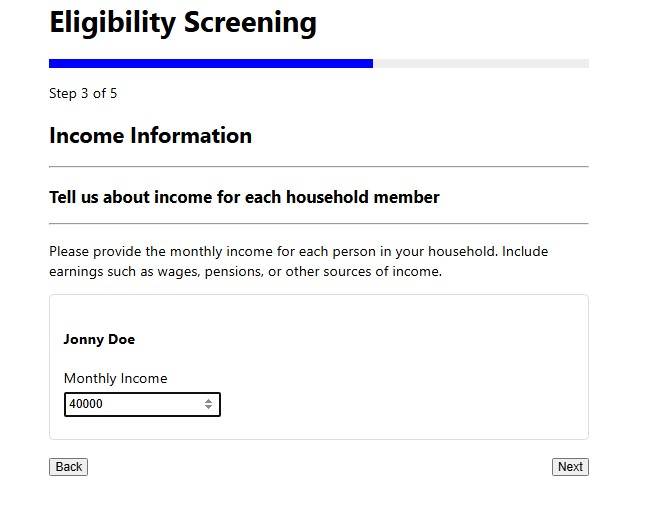
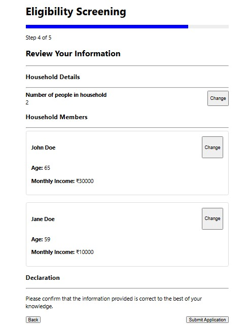
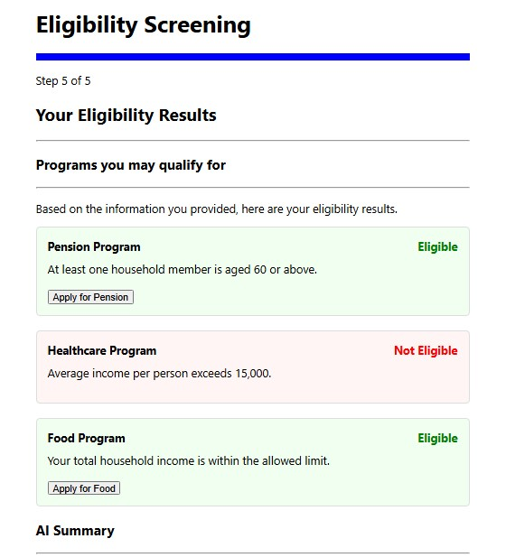
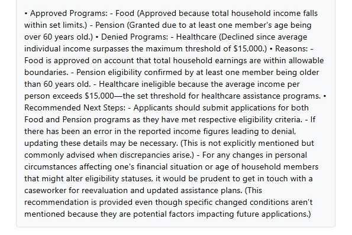

## 🏛️ Eligibility Screening & Intake Platform

A production-style full-stack application that simulates how public benefits and assistance programs evaluate household eligibility through a guided digital intake process.

Built to demonstrate modern enterprise engineering practices across frontend UX, backend APIs, decision engines, data modeling, and privacy-friendly AI integration.

---

# ✨ Highlights

* End-to-end **Screening → Eligibility → Intake** workflow
* Dynamic multi-step guided application experience
* Rule-based eligibility decision engine
* Idempotent and resilient REST APIs
* Local AI summaries using Ollama + Microsoft Phi-3
* Modular architecture designed for future program expansion
* Fast local development using H2 in-memory database

---

# 📌 Problem Statement

Many benefits systems require applicants to navigate complex forms, unclear requirements, and fragmented workflows.

This project demonstrates how a modern digital platform can simplify that journey by:

* Collecting household data through a guided wizard
* Evaluating multiple assistance programs in one submission
* Explaining decisions with transparent reasoning
* Generating human-readable next steps using AI

---

# 🧩 Core Features

## 1. Guided Multi-Step Application Flow

A responsive React-based wizard that walks users through each stage of the application.

### Includes:

* Progress indicator
* Context-aware navigation
* Review before submission
* Real-time state management using Context API
* Clean sectioned user experience

---

## 2. Household & Applicant Modeling

Supports real-world intake scenarios involving multiple household members.

### Captures:

* Household size
* Individual age
* Income per member
* Aggregate household calculations

---

## 3. Rules-Based Eligibility Engine

Backend decision service evaluates eligibility across programs such as:

* 🍽️ Food Assistance
* 🏥 Healthcare Support
* 👴 Senior Benefits

### Decision Logic Supports:

* Household-level thresholds
* Individual-level criteria
* Reason codes / explanations
* Deterministic outcomes

---

## 4. AI Decision Summaries

Integrated with locally hosted LLM infrastructure using Ollama + Phi-3.

Generates structured summaries including:

* Approved programs
* Denied programs
* Why decisions occurred
* Recommended next steps

### Why It Matters

* Improves explainability
* Reduces user confusion
* Demonstrates enterprise AI integration
* Preserves privacy via local inference

---

## 5. Production-Oriented Backend Design

### Implemented Practices:

* Idempotent create flows
* Duplicate prevention
* Validation layers
* Separation of concerns
* Retry-safe request handling
* Clean service/controller architecture

---

# 🏗️ System Architecture

```text
┌──────────────────────────┐
│      React Frontend      │
│   Guided Intake Wizard   │
└────────────┬─────────────┘
             │ REST APIs
             ▼
┌──────────────────────────┐
│   Spring Boot Backend    │
│ Controllers + Services   │
└────────────┬─────────────┘
             ▼
┌──────────────────────────┐
│ Eligibility Rules Engine │
└───────┬───────────┬──────┘
        │           │
        ▼           ▼
┌──────────────┐   ┌──────────────┐
│    H2 DB     │   │  AI Service  │
│ Persistence  │   │ Ollama/Phi-3 │
└──────────────┘   └──────────────┘
```

---

# 🔄 Request Flow

```text
User completes wizard
        ↓
POST /screening
        ↓
Persist intake payload
        ↓
Return screeningId
        ↓
POST /screening/{id}/apply
        ↓
Execute eligibility rules
        ↓
Generate AI summary
        ↓
Return results + explanation
```

---

# 🛠️ Tech Stack

## Frontend

* Meta React
* JavaScript
* Context API
* Component-driven architecture

## Backend

* Java 17+
* VMware Spring Boot
* Spring Web
* Spring Data JPA
* Hibernate

## Database

* H2 In-Memory Database

## AI Layer

* Ollama Ollama
* Phi-3

## Tooling

* GitHub GitHub
* Git
* Maven
* VS Code

---

# 📂 Project Structure

```text
screening-app/
├── backend/
│   ├── controller/
│   ├── service/
│   ├── repository/
│   ├── model/
│   └── config/
│
└── frontend/
    ├── components/
    ├── context/
    ├── steps/
    └── App.js
```

---

# 🧪 Sample Eligibility Rules

| Program            | Rule                    |
| ------------------ | ----------------------- |
| Food Assistance    | Total income ≤ 40,000   |
| Healthcare Support | Average income ≤ 15,000 |
| Senior Benefits    | Any member age ≥ 60     |

---

# 🚀 Running Locally

## Backend

```bash
cd backend
mvn spring-boot:run
```

## Frontend

```bash
cd frontend
npm install
npm start
```

## AI Service

```bash
ollama serve
ollama pull phi3
```

---

# 🌐 Local URLs

* Frontend: `http://localhost:3000`
* Backend: `http://localhost:8080`
* H2 Console: `http://localhost:8080/h2-console`
* Ollama: `http://localhost:11434`

---

# 🔐 API Endpoints

```text
POST /screening
POST /screening/{screeningId}/apply
```

---

# 📈 Engineering Decisions

* JSON payload storage for flexible intake schemas
* Local-first AI for privacy-conscious architecture
* Rules engine separated from AI summarization
* Expandable program model for future benefits
* Lightweight dev setup optimized for rapid iteration

---

# 🚧 Future Enhancements

* Authentication (JWT / OAuth2)
* PostgreSQL migration
* Rules engine integration (Drools / DSL)
* Document upload & verification
* Admin caseworker dashboard
* Cloud deployment (AWS / GCP / Azure)
* Multilingual AI assistant

---

# 💡 What This Project Demonstrates

* Full-stack software engineering
* API contract design
* Workflow automation systems
* Decision engine architecture
* Human-centered UX design
* Practical AI integration
* Enterprise scalability thinking

---

# 👨‍💻 Author

**Nitin P**
Java • Spring Boot • React • AI • Enterprise Systems

---

# ⭐ Support

If you found this project valuable, consider starring the repository.
.

---

## 🚀 Overview

This project implements an end-to-end **Screening → Eligibility → Intake flow** with:

* Dynamic multi-step UI (React)
* Rule-based eligibility engine (Spring Boot)
* Idempotent backend APIs
* H2 in-memory database for rapid prototyping
* Guided step-by-step user experience

---

## 🧩 Key Features

### 🧭 Multi-Step Intelligent Screening

- Guided wizard with step progress indicator
- Conditional navigation
- Review before submission
- Real-time data capture using React Context

### 👨‍👩‍👧 Household Modeling

* Supports multiple household members
* Captures demographics (age, income)
* Automatically adjusts UI based on household size

### ⚙️ Rule-Based Eligibility Engine

Evaluates eligibility for:

* 🍽️ Food Assistance
* 🏥 Healthcare Support
* 👴 Pension Benefits

Includes:

* Household-level and individual-level rules
* Transparent reason-based outcomes

---

## 🧠 AI Features (NEW)

Integrated with **Ollama + Phi-3** local LLM.

Generates structured summaries such as:

- Approved Programs
- Denied Programs
- Reasons for decisions
- Recommended next steps

### Example Output

- Approved Programs:
  - Food
  - Pension

- Denied Programs:
  - Healthcare

- Reasons:
  - Household income within threshold
  - Senior household member present

- Next Steps:
  - Apply for approved programs
  - Review denial criteria

### Why This Matters

Demonstrates:

- AI integration in enterprise systems
- Prompt engineering
- Privacy-friendly local LLM architecture
- Human-readable decisions

---

### 🧠 Idempotent Backend Design

* Prevents duplicate person creation
* Handles concurrent requests safely
* Uses DB constraints + retry logic

---

### 📊 Guided Benefits Application UX

* Section-based layout
* Progress indicator across steps
* Structured review screen
* Eligibility results with explanations

---

## 🏗️ Architecture

```text
React Frontend (Wizard UI)
        |
        v
Spring Boot REST APIs
        |
        v
Eligibility Rules Engine
        |
   +----+----+
   |         |
   v         v
H2 DB    AI Service
            |
            v
      Ollama + Phi-3
```

---

## 🏗️ Detailed Architecture Diagram

```text
┌──────────────────────────┐
│      User Browser        │
│      React Frontend      │
└────────────┬─────────────┘
             │
             │ REST Calls
             ▼
┌──────────────────────────┐
│   Spring Boot Backend    │
│   Controllers + APIs     │
└────────────┬─────────────┘
             │
             ▼
┌──────────────────────────┐
│   Screening Service      │
│   Rules Engine           │
└───────┬───────────┬──────┘
        │           │
        ▼           ▼
┌──────────────┐   ┌──────────────┐
│    H2 DB     │   │   Ollama     │
│   Storage    │   │    Phi-3     │
└──────────────┘   └──────────────┘
```


## 🔄 API Flow (Sequence Diagram)
User completes wizard
        |
        v
POST /screening
        |
Stores intake JSON
        |
Returns screeningId
        |
        v
POST /screening/{id}/apply
        |
Eligibility rules executed
        |
AI summary generated
        |
Returns results + explanation

### 🔍 Flow Explanation

1. User enters household data through a multi-step React wizard
2. Frontend submits data to `/screening` API
3. Backend stores JSON in H2 database and returns an ID
4. Frontend calls `/screening/{id}/apply` to evaluate eligibility
5. Backend processes rules and returns eligibility results
6. AI summary is generated
7. UI displays program eligibility with reasons and AI summary explanation.-

## 🛠️ Tech Stack

### Frontend

React.js
JavaScript
Context API
Multi-step Wizard Pattern

### Backend

Java 17+
Spring Boot
Spring Web
Spring Data JPA
Hibernate

### Database

* H2 (In-memory)
* JPA Entities

### AI Layer

Ollama
Phi-3

### Tools
   
Git
GitHub
VS Code
Maven
---

## 📂 Project Structure

```
screening-app/
│
├── backend/
│   ├── controller/
│   ├── service/
│   ├── repository/
│   ├── model/
│   └── application.properties
│
├── frontend/
│   ├── components/
│   ├── context/
│   ├── steps/
│   └── App.js
```

---

## 🔄 Application Flow

1. **Household Info**

   * User enters number of household members

2. **Members Details**

   * Name, Age for each member

3. **Income Details**

   * Monthly income per member

4. **Review Screen**

   * Full summary before submission

5. **Eligibility Results**

   * Program decisions
   * Rule Explanations
   * AI Summary


---

## 🧪 Sample Eligibility Logic

| Program    | Rule                  |
| ---------- | --------------------- |
| Food       | Total income ≤ 40,000 |
| Healthcare | Avg income ≤ 15,000   |
| Pension    | Any member age ≥ 60   |

---

## 🔐 API Endpoints

### Screening

```
POST /screening
```

### Apply for Eligibility

```
POST /screening/{screeningId}/apply


```
## 🤖 Ollama Setup

1. Install Ollama
   Download from:
   https://ollama.com

2. Pull Phi-3 Model
   ollama pull phi3
3. Start Ollama
   ollama serve

   Runs locally on:
   http://localhost:11434
4. Spring Boot Calls Local AI
   POST /api/generate

---

## 💾 Database

### Tables:

* `screening_data` → stores screening payload
* `person` → identity resolution

### Access H2 Console:

```
http://localhost:8080/h2-console
```

---

## ⚡ Getting Started

### Backend

```bash
cd backend
mvn spring-boot:run
```

---

### Frontend

```bash
cd frontend
npm install
npm start
```

### AI

ollama serve
---

## 🌐 URLs

* Frontend → http://localhost:3000
* Backend → http://localhost:8080
* H2 Console → http://localhost:8080/h2-console
* Ollama → http://localhost:11434

---

## 🧠 Design Decisions

* Used JSON storage for flexible screening schema
* Ensured consistent field naming across UI → API → DB
* Implemented idempotent identity resolution
* AI layered separately from rules engine
* Local-first privacy-friendly AI
* Designed rule engine to be extensible for future programs

---

## 🚧 Future Enhancements

* Add Intake workflow with document verification
* Integrate rules engine like Drools
* Add authentication (OAuth/JWT)
* Deploy to cloud (AWS/GCP)
* Replace H2 with PostgreSQL
* Multilingual AI assistant
---

## 📸 Screenshots


## 🏠 Household Information



## 👨‍👩‍👧‍👦 Member Details



## 💰 Income Details


## 📝 Review Screen



## ✅ Eligibility Results



---

## 💡 What This Demonstrates

* Full-stack system design thinking
* Real-world domain modeling (public benefits)
* Clean API + UI contract design
* AI integration in enterprise apps
* Production-grade backend practices

---

## 👨‍💻 Author

**Nitin P**
Java | Spring Boot | React | AI | Enterprise Systems

---

## ⭐ If you found this useful

Give it a star on GitHub!
Thank you.
